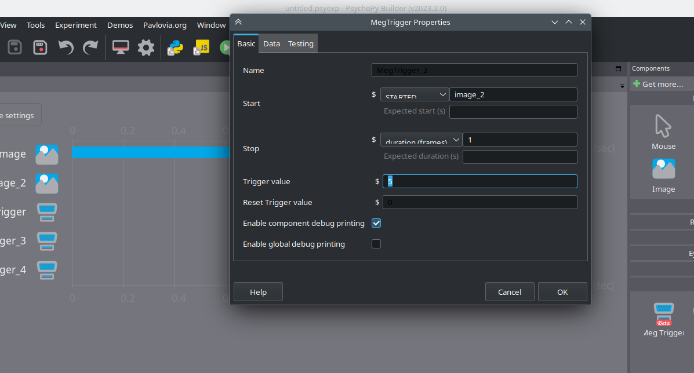

# psychopy-MEG-triggers

Builder component for interacting with NI6321 PCIe card to send triggers to a MEGIN TRIUX MEG.

## Getting started

For now, only manual installation is supported.

Simply copy the folder `meg-triggers` to your `psychopy` components installation folder, e.g. `anaconda3/envs/psychopy-env/lib/python3.8/site-packages/psychopy/experiment/components/`. Then under `I/O` a component called `Meg Trigger` should appear

Anyhwere in the code you can also write `send_trigger(value, duration)` to manually send a trigger, e.g. `send_trigger(15, duration=0.005)` will raise the trigger line to 15 for 5 milliseconds. If you set `duration=0` the line will be kept at the trigger value and not be reset to 0.
